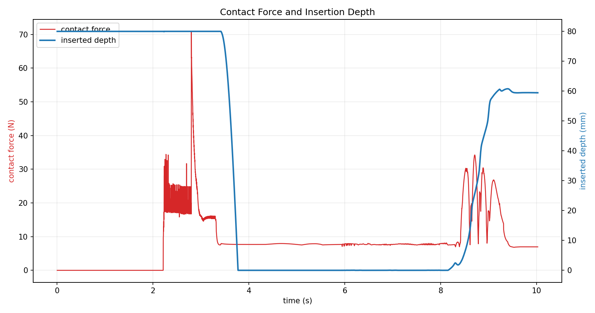
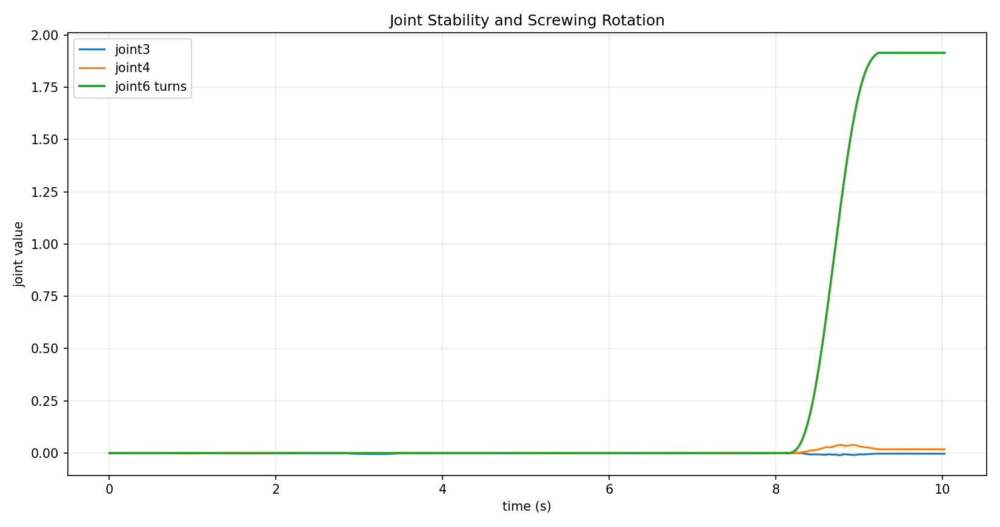
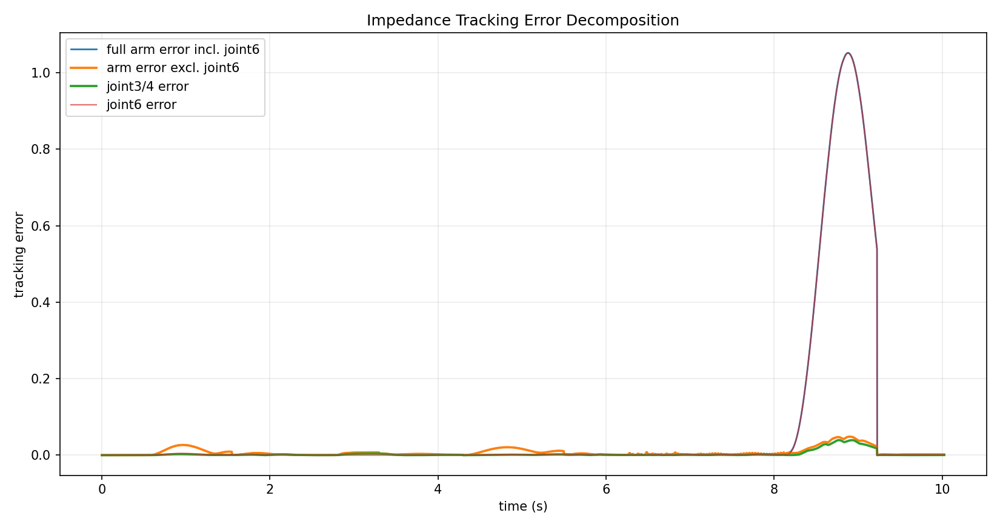
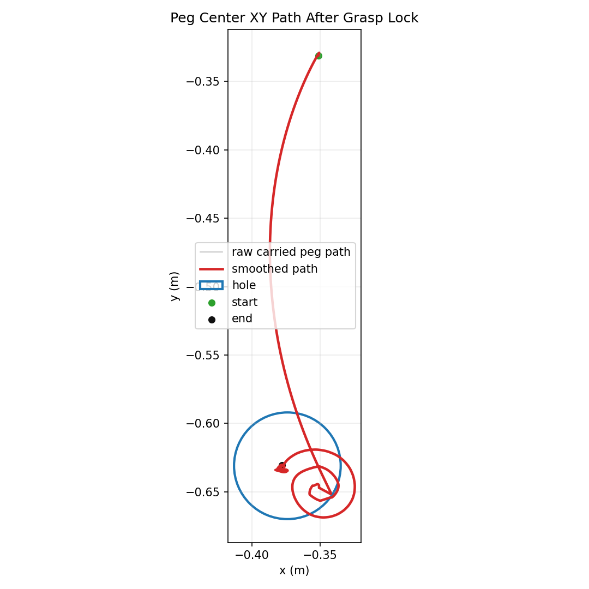

# Force Control Evaluation

## Quantitative Results

| Metric | Value |
| --- | ---: |
| duration_s | 10.022 |
| max_contact_force_n | 70.8908 |
| mean_contact_force_n | 8.70492 |
| final_inserted_depth_m | 0.059447 |
| insertion_phase_depth_change_m | 0.059447 |
| max_abs_joint3_rad | 0.00963759 |
| max_abs_joint4_rad | 0.0392193 |
| final_joint6_turns | 1.91424 |
| max_tracking_error | 1.05189 |
| max_tracking_error_without_q6 | 0.0483604 |
| max_q34_tracking_error | 0.0392848 |
| final_xy_error_m | 0.00408325 |

## Charts

## Interpretation

The controller is torque/force based: MuJoCo `<motor>` actuators receive generalized force commands. The impedance law computes `tau = qfrc_bias + Kp(q_des-q) + Kd(qd_des-qd)`, then clips it by actuator limits.

The full tracking-error spike near insertion is caused by the deliberate multi-turn `joint6` screwing command. The chart therefore also shows tracking error excluding `joint6`, which better reflects translational insertion stability.

Compared with the earlier position-control demo, force control allows contact to create tracking error and measurable contact force. This is less rigid than position control, but closer to deployable behavior because force/torque limits and damping shape the contact response.
